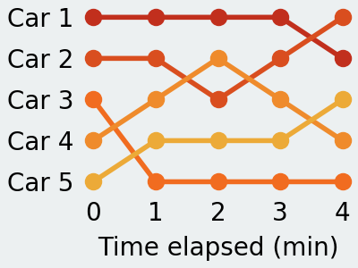

Simple matplotlib based script generates a visually friendly visualization for rank evolution.

## How to use
Using this script is easy! You will need to create a folder, move your `settings.json` and `data.json` files into it, and run `RankVisualizer.py` with the path to that folder as a commandline argument like so:

```
python RankVisualizer.py "PATH_TO_FOLDER"
```

### Settings
Firstly, setup the way you want your chart to look in the `settings.json` file, which has a structure outlined below:
```
{
  "x_data": [horizontal axis labels, ...] | null,
  "show_x_labels": true | false,
  "x_title": "X Axis Title" | null,
  "show_y_labels": true | false,
  "y_title": "Y Axis Title" | null,
  "title": "Figure Title" | null,
  "height": Height in inches,
  "width": Width in inches,
  "dpi": DPI (image resolution)
}
```

### Data
Then, simply fill the `data.json` file with the data you want to plot! Here, a list of the each entity's rank at each point on the horizontal axis should be stored.
```
{
  "entity 1": [rank at each value of x, ...],
  "entity 2": [rank at each value of x, ...],
   .
   .
}
```
*NOTE: This visualizer is very sensitive and peculiar on how the input data is structured, rendering it not very versatile. For example, each entry needs to contain rank data for every position on the horizontal axis. If you have any ideas on how to make it more flexible, please share! :)*

### Example
In this example, we wish to visualize the evolution of car positions at each minute of a race, in order to quickly see comebacks and overtakes. In the `data.json` file, we add entries for each car's position at each minute in a list.
*(ie Car 3 starts off at position 3, and regresses to position 5 at the first minute, its data is therefore represented with "Car 3": [3, 5, ...])*



We can now easily see how each car did during that race; Car 1 managed to hold its pole position for most of it, before being overtaken at the last minute by Car 2 whereas Car 3 seems to have had an extremely bad start, not being able to recover from it.
